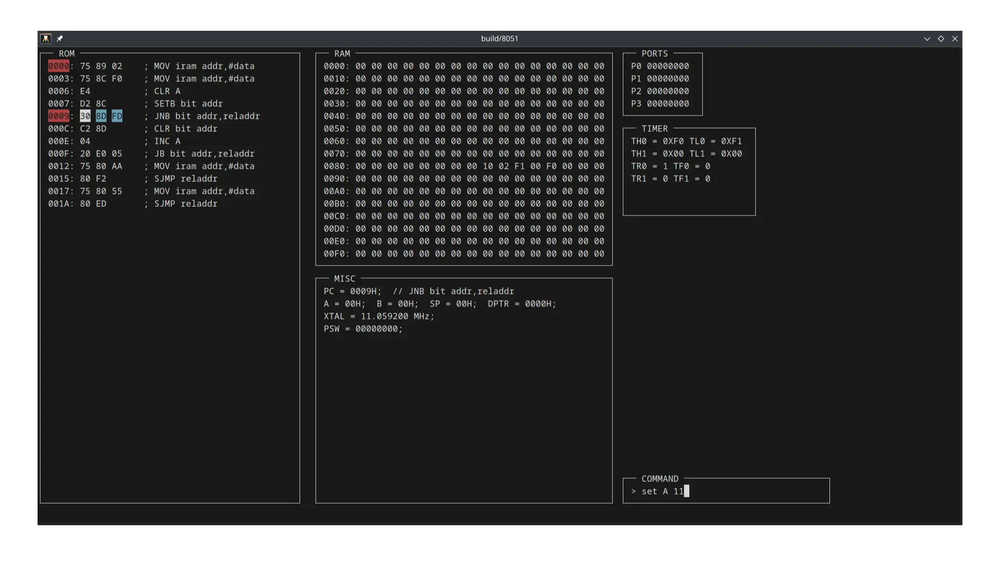
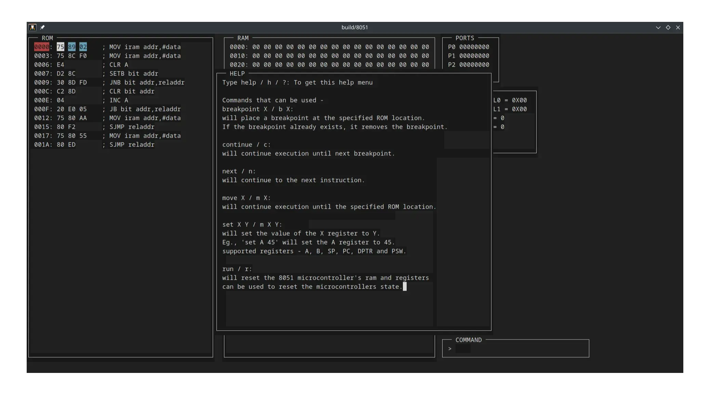

# 8051 Emulator

This is an 8051 emulator I build from scratch, all the instructions of the 8051 microcontroller and its functionalities have been rewritten in C.

It is a multithreaded program that can take a .bin file and execute 8051 instructions while also providing a user-friendly menu using Ncurses to monitor its execution. It also offers some basic debugging features that allows you to step through the instructions manually set the register values manually among other things.

This program was written in linux using Pthreads and Ncurses. With Ncurses being included using CMake. It does not depend on any other external libraries. It is not portable to windows without any modifications.

All the details of the 8051 instructions were taken from [here](https://www.win.tue.nl/~aeb/comp/8051/set8051.html). And the compiler for 8051 and some other information was picked up from [here](https://www.microchip.com/en-us/development-tool/c51asm).

## Features
The program supports the following features:
- Ability to execute **all the 8051 instructions**.
- Has some basic **debugging features** that includes but are not limited to **breakpoints**, abilty to **step through code** and the ability to **set register values manually**.
- Uses **ncurses** to display:
  - ROM contents, including the **opcodes** and its equivalent **instructions in text**.
  - **RAM** contents
  - Some important **registers** like A, B, PC, DPTR and others.
  - All the **ports** and their output in binary.
  - **Timer** register and flags.
## Build and Run
```bash
git clone https://github.com/sahil-1035/8051-emulator.git
cd 8051-emulator
mkdir build
cmake -B build -G Ninja
ninja -C build
./build/8051
```
For using `make`, replace the above `cmake` and `ninja` commands with the following:
```
cmake -B build
make -C build
```

## Usage
```
Usage: ./8051 [OPTION] [VALUE]
  -f, --bin-file FILE_PATH
 ```
Type help/h/? in the command window after the program starts to get other usage information.
## Why I made this project
- To understand how **machine language** is executed in the low level.
- To learn **Ncurses**.
- To get used to **git**.
- To understand the usage of **threads**, **mutexes** and **conditional variables**.
## What doesn't work
+ Interupts
+ Serial Communication
## Some Images
- Image of the program paused on a breakpoint.

- Image of the internal help menu.

